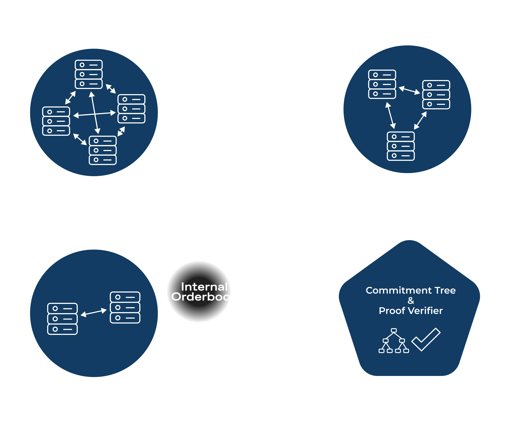

# Renegade Darkpool


[](https://twitter.com/renegade_fi)
[](https://discord.gg/renegade-fi)

<p align="center">

</p>

Renegade is building the on-chain dark pool. A decentralized exchange in which privacy is not an option, but the *standard*. 

To follow along, check out our: <br />
[Website](https://renegade.fi) <br />
[Docs](https://docs.renegade.fi) <br />
[Twitter](https://twitter.com/renegade_fi) <br />
[Discord](https://discord.gg/renegade-fi) <br />
[Substack](https://renegadefi.substack.com/) <br />
[Jobs Page](https://jobs.lever.co/renegade/) <br />

## Darkpool Nodes
This repository contains the bulk of the p2p networking code that backs our decentralized matching engine. At a high level, each node in the network manages some set of orders know to the node. The trust assumption between the node and the trader being only that the node doesn't leak order information. I.e. nodes by default do not have the ability to create, remove, or modify orders and balances.

Nodes gossip about encrypted order state, and perform [MPC](https://docs.renegade.fi/core-concepts/mpc-explainer)s to emulate a matching engine. Once a match is found, the peers commit to the match by creating a set of zero knowledge proofs that argue:
1. Order and balance input validity and inclusion in the on-chain, global state tree
2. Auditably correct execution of the matching engine during the course of an MPC
3. Correct encryption of the matches result under both traders' public keys

The end result: complete pre-trade and post-trade privacy.

Peers are organized into fail-stop fault-tolerant clusters that replicate and horiztonally scale the matching engine. The inter-cluster semantics, however, operate under a fail-arbitrary (Byzantine) assumption. See the diagram below for a visualization of the network with three clusters; including the publically available cluster managed by Renegade.

<p align="center">

</p>

## Installation
To run a local instance of the relayer simply run the project in the top level directory and specify a port for inbound access
```
cargo run -- -p 8000
```
To view a list of configuration options available to the CLI, run
```
cargo run -- --help
```

Finally, to run integration tests for any of the crates in the workspace, run
```
./setup.zsh
```
To setup the `cargo-integrate` command. Then run `cargo-integrate <crate-name>` for the target crate. For example, to run the integration tests for the `circuits` package, which holds ZK and MPC circuit definitions, run:
```
cargo-integrate circuits
```


